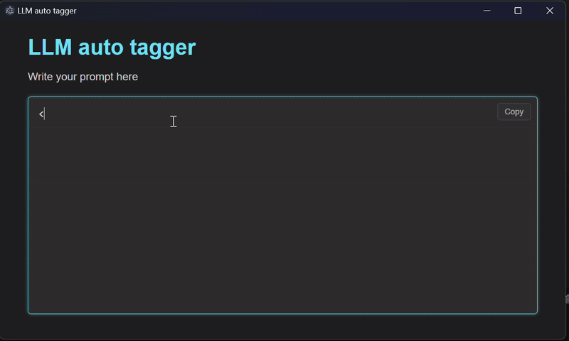

# LLM tagger

Quickly create tags and code blocks for LLMs prompts.

## Quick start

```bash
> npm install
> npm run generate-icons # this will use `icon.jpg` in the root directory
> npm run start
```

## Build

```bash
> npm run build
```

## Usage

